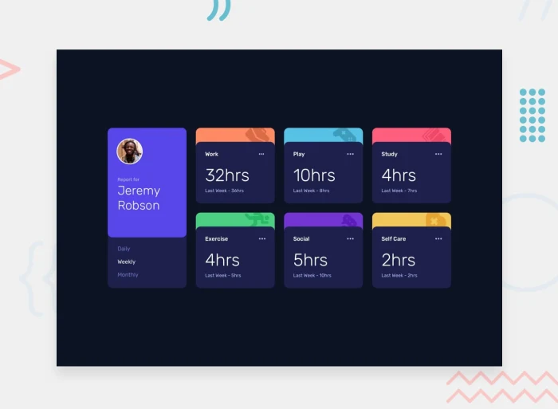

## 🕒 Time tracking dashboard
Este proyecto es una aplicación web construida con **React**, **Vite** y **CSS**, diseñada para mostrar un panel de seguimiento del tiempo de un usuario. Los datos se muestran en tarjetas con diferentes categorías como trabajo, estudio, ejercicio, y más. La aplicación permite al usuario cambiar entre diferentes intervalos de tiempo (`diario`, `semanal`, `mensual`) para visualizar el tiempo que ha dedicado a cada actividad.

🔗 **[Live Demo]()**  
🔗 **[Solution Demo]()**  

## Tecnologías utilizadas

- **React**: Utilizado para crear componentes reutilizables y mantener el código modular.
- **Vite**: Una herramienta de construcción rápida y optimizada para el desarrollo con React.
- **Cypress**: Framework para realizar testing para garantizar que la aplicación funcione correctamente.
- **Animate.css**: Para aplicar animaciones a las tarjetas y al componente de usuario. 

## Feedback 💬  
¡Cualquier comentario o sugerencia es bienvenido! No dudes en abrir un issue o contactarme directamente.  
## 🕒 Time tracking dashboard
Este proyecto es una aplicación web construida con **React**, **Vite** y **CSS**, diseñada para mostrar un panel de seguimiento del tiempo de un usuario. Los datos se muestran en tarjetas con diferentes categorías como trabajo, estudio, ejercicio, y más. La aplicación permite al usuario cambiar entre diferentes intervalos de tiempo (`diario`, `semanal`, `mensual`) para visualizar el tiempo que ha dedicado a cada actividad.

🔗 **[Live Demo]()**  
🔗 **[Solution Demo]()**  

## Tecnologías utilizadas

- **React**: Utilizado para crear componentes reutilizables y mantener el código modular.
- **Vite**: Una herramienta de construcción rápida y optimizada para el desarrollo con React.
- **Cypress**: Framework para realizar testing para garantizar que la aplicación funcione correctamente.
- **Animate.css**: Para aplicar animaciones a las tarjetas y al componente de usuario. 

## Feedback 💬  
¡Cualquier comentario o sugerencia es bienvenido! No dudes en abrir un issue o contactarme directamente.  

## 📌 Notas
Este es un ejercicio del sitio [Frontend Mentor](https://www.frontendmentor.io/), adaptado a un entorno moderno con React. 

## 📷 Capturas de pantallas 
  
